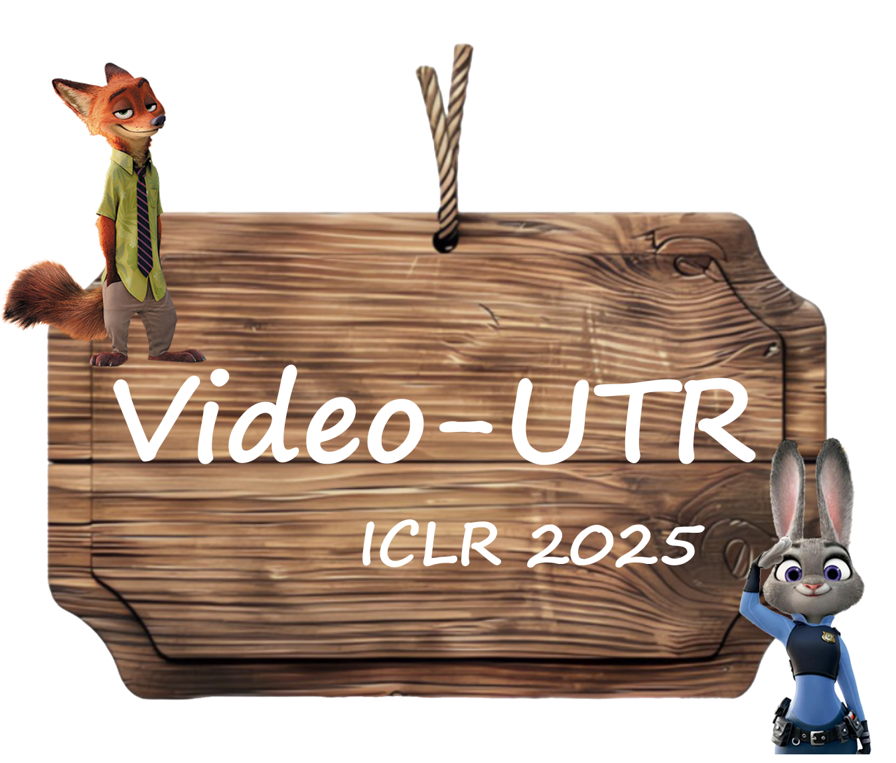
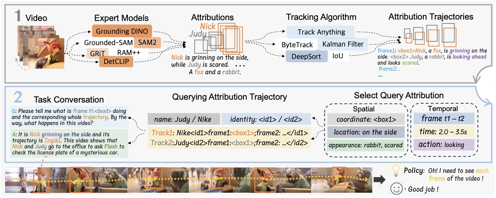
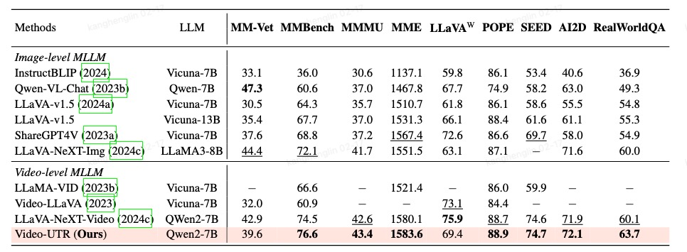
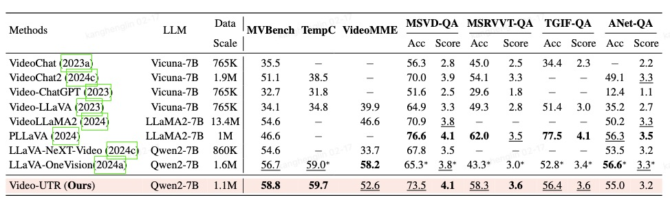

<div align="center" style="font-family: charter;">

<h1><i>Video-UTR</i>:</br> UNHACKABLE TEMPORAL REWARDING FOR SCALABLE VIDEO MLLMS</h1>


<br />

<a href="" target="_blank">
    
</a>
<a href="https://ahnsun.github.io/UTR/" target="_blank">
    
</a>
<a href="https://huggingface.co/Kangheng/Video-UTR-7b" target="_blank">
    
</a>
<a href="" target="_blank">
    
</a>

<div>
    <a href="" target="_blank">En Yu</a><sup>1*</sup>,</span>
    <a href="" target="_blank">Kangheng Lin</a><sup>2*</sup>,</span>
    <a href="" target="_blank">Liang Zhao</a><sup>3*</sup>,</span>
    <a href="" target="_blank">Yana Wei</a>
    <a href="" target="_blank">Zining Zhu</a>
    <a href="" target="_blank">Haoran Wei</a>
    <a href="" target="_blank">Jianjian Sun</a>
    <a href="" target="_blank">Zheng Ge</a>
    <a href="" target="_blank">Xiangyu Zhang</a>
    <a href="" target="_blank">Jingyu Wang</a>
    <a href="" target="_blank">Wenbing Tao</a>
</div>

<div>
    <sup>1</sup>HUST 
    <sup>2</sup>BUPT 
    <sup>3</sup>StepAI 
</div>


<p align="justify"><i>
We propose the theory of temporal hacking, from a reinforcement learning perspective, to explain anti-scaling law phenomenon in video MLLMs. We introduce a novel metric, Temporal Perplexity (TPL), to quantify the severity of temporal assignment. Through extensive experiments, we use the TPL score to analyze the causes and features of temporal hacking, leading to the development of two guiding principles for video-language modeling. Guided by these two principles, we further propose Unhackable Temporal Rewarding (UTR) and build a powerful video MLLM, ie., Video-UTR, a new family of state-of-the-art video-LMMs.
</i></p>

</div>

## Release
- `2025-02-18` 🎄: Initial release of Video-UTR model and evaluation code

## Demo

```python
import av
import torch
from transformers import AutoProcessor, LlavaOnevisionForConditionalGeneration
import numpy as np
from huggingface_hub import hf_hub_download

model_id = "Kangheng/Video-UTR-7b"

model = LlavaOnevisionForConditionalGeneration.from_pretrained(
    model_id, 
    torch_dtype=torch.float16, 
    low_cpu_mem_usage=True, 
).to(0)

processor = AutoProcessor.from_pretrained(model_id)

def read_video_pyav(container, indices):
    '''
    Decode the video with PyAV decoder.
    Args:
        container (`av.container.input.InputContainer`): PyAV container.
        indices (`List[int]`): List of frame indices to decode.
    Returns:
        result (np.ndarray): np array of decoded frames of shape (num_frames, height, width, 3).
    '''
    frames = []
    container.seek(0)
    start_index = indices[0]
    end_index = indices[-1]
    for i, frame in enumerate(container.decode(video=0)):
        if i > end_index:
            break
        if i >= start_index and i in indices:
            frames.append(frame)
    return np.stack([x.to_ndarray(format="rgb24") for x in frames])


# define a chat history and use `apply_chat_template` to get correctly formatted prompt
# Each value in "content" has to be a list of dicts with types ("text", "image", "video") 
conversation = [
    {
        "role": "user",
        "content": [
            {"type": "text", "text": "Why is this video funny?."},
            {"type": "video"},
            ],
    },
]

prompt = processor.apply_chat_template(conversation, add_generation_prompt=True)

video_path = hf_hub_download(repo_id="raushan-testing-hf/videos-test", filename="sample_demo_1.mp4", repo_type="dataset")
container = av.open(video_path)

# sample uniformly 8 frames from the video, can sample more for longer videos
total_frames = container.streams.video[0].frames
indices = np.arange(0, total_frames, total_frames / 15).astype(int)
clip = read_video_pyav(container, indices)
inputs_video = processor(text=prompt, videos=clip, padding=True, return_tensors="pt").to(model.device)

output = model.generate(**inputs_video, max_new_tokens=2048, do_sample=False)
print(processor.decode(output[0][2:], skip_special_tokens=True))
```

## Installation

### 1. Environment Setup
```bash
# Training environment, which is built on LLaVA-NeXT
conda create -n video_utr python=3.10 -y
conda activate video_utr
git clone --recursive https://github.com/linkangheng/Video-UTR.git
cd train && pip install -e ".[train]"

# Evaluation environment, which is built on lmms-eval
cd eval && pip install -e .
```

### 2. Data Preparation

Download the data from 🤗[UTR-Data](https://huggingface.co/datasets/Kangheng/UTR-Data)(coming soon) and 🤗[Video-UTR-Data](https://huggingface.co/datasets/Kangheng/Videochat2-PPL)(coming soon) , then put them in the `data` folder and unzip them.


## Training

### Pretraining

```bash
NNODES=8
LLM_VERSION="Qwen/Qwen2-7B-Instruct"
VISION_MODEL_VERSION="google/siglip-so400m-patch14-384"
PROMPT_VERSION=plain
BASE_RUN_NAME="utr_pretrain"

torchrun --nproc_per_node=8 \
    --master_addr $MASTER_ADDR \
    --master_port ${MASTER_PORT} \
    --nnodes $NNODES \
    --node_rank $NODE_RANK \
    llava/train/train_mem.py \
    --deepspeed scripts/zero3.json \
    --model_name_or_path ${LLM_VERSION} \
    --version ${PROMPT_VERSION} \
    --data_path data/llava_pretrain/blip_laion_cc_sbu_558k.json \
    --image_folder data/llava_pretrain/images \
    --vision_tower ${VISION_MODEL_VERSION} \
    --mm_tunable_parts="mm_mlp_adapter" \
    --mm_vision_select_layer -2 \
    --mm_projector_type mlp2x_gelu \
    --mm_use_im_start_end False \
    --mm_use_im_patch_token False \
    --bf16 True \
    --output_dir checkpoints/${BASE_RUN_NAME} \
    --num_train_epochs 1 \
    --per_device_train_batch_size 16 \
    --per_device_eval_batch_size 4 \
    --gradient_accumulation_steps 1 \
    --evaluation_strategy "no" \
    --save_strategy "no" \
    --save_steps 50000 \
    --learning_rate 1e-3 \
    --weight_decay 0. \
    --warmup_ratio 0.03 \
    --lr_scheduler_type "cosine" \
    --logging_steps 1 \
    --tf32 True \
    --model_max_length 8192 \
    --gradient_checkpointing True \
    --dataloader_num_workers 16 \
    --lazy_preprocess True \
    --report_to wandb \
    --run_name $BASE_RUN_NAME 
```

### Finetuning

```bash
NNODES=8
VISION_MODEL_VERSION="google/siglip-so400m-patch14-384"
PROMPT_VERSION="qwen2"
BASE_RUN_NAME="video-utr-7b"

torchrun --nproc_per_node=8 \
    --master_addr $MASTER_ADDR \
    --master_port ${MASTER_PORT} \
    --nnodes $NNODES \
    --node_rank $NODE_RANK \
    llava/train/train_mem.py \
    --deepspeed scripts/zero3.json \
    --model_name_or_path ${CKPT_PATH} \
    --version ${PROMPT_VERSION} \
    --data_path sft/data.yaml \
    --image_folder data/images \
    --video_folder data/videos \
    --pretrain_mm_mlp_adapter="checkpoints/utr_pretrain/mm_projector.bin" \ # replace with your own pretrain adapter
    --mm_tunable_parts="mm_vision_tower,mm_mlp_adapter,mm_language_model" \
    --mm_vision_tower_lr=2e-6 \
    --vision_tower ${VISION_MODEL_VERSION} \
    --mm_projector_type mlp2x_gelu \
    --mm_vision_select_layer -2 \
    --mm_use_im_start_end False \
    --mm_use_im_patch_token False \
    --group_by_modality_length True \
    --image_aspect_ratio anyres_max_9 \
    --image_grid_pinpoints  "(1x1),...,(6x6)" \
    --mm_patch_merge_type spatial_unpad \
    --bf16 True \
    --run_name $BASE_RUN_NAME \
    --output_dir "checkpoints/$BASE_RUN_NAME" \
    --num_train_epochs 1 \
    --per_device_train_batch_size 1 \
    --per_device_eval_batch_size 4 \
    --gradient_accumulation_steps 8 \
    --evaluation_strategy "no" \
    --save_strategy "steps" \
    --save_steps 100 \
    --save_total_limit 1 \
    --learning_rate 1e-5 \
    --weight_decay 0. \
    --warmup_ratio 0.03 \
    --lr_scheduler_type "cosine" \
    --logging_steps 1 \
    --tf32 True \
    --model_max_length 32768 \
    --gradient_checkpointing True \
    --dataloader_num_workers 4 \
    --lazy_preprocess True \
    --report_to wandb \
    --torch_compile True \
    --torch_compile_backend "inductor" \
    --dataloader_drop_last True \
    --frames_upbound 32
```

## Evaluation

You can easily reproduce the results in our paper using the script below.

```bash

image_task="mmvet,mmbench_en_dev,mmmu,mme,pope,seedbench,ai2d,realworldqa"
video_task="mvbench,tempcompass,videomme,activitynetqa"
python -m accelerate.commands.launch \
    --num_processes=8 \
    -m lmms_eval \
    --model llava_hf \
    --model_args pretrained="Kangheng/Video-UTR-7b" \
    --tasks $image_task \ # or $video_task
    --batch_size 1 \
    --log_samples \
    --output_path ./logs/
```

## Results
### Image Understanding Performance


### Video Understanding Performance


> Note: The evaluation results may differ slightly from our tables due to potential variations in transformers versions, OpenAI API configurations, and other environmental settings. 

## Acknowledgement
Our work is built upon the [LLaVA-NeXT](https://github.com/LLaVA-VL/LLaVA-NeXT/) codebase, we sincerely appreciate their foundational contributions to the community. Our evaluation code is build upon [lmms-eval](https://github.com/EvolvingLMMs-Lab/lmms-eval). We acknowledge their team for providing this excellent toolkit for evaluating multimodal large language models. 

## Citation

If you find our paper and code useful in your research, please consider giving us a star :star: and citing our work :pencil:
```
@article{video-utr,
    title={Unhackable Temporal Rewarding for Scalable Video MLLMs},
    author={En Yu, Kangheng Lin, Liang Zhao, Yana Wei, Zining Zhu, Haoran Wei, Jianjian Sun, Zheng Ge, Xiangyu Zhang, Jingyu Wang, and Wenbing Tao},
    journal={arXiv preprint arXiv:2412.10360},
    year={2025}
}
```